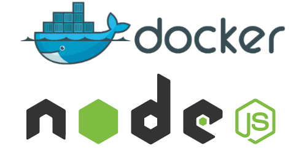

#DOCKER-COMPOSE-NODEJS-EXPRESS-MYSQL
In this sample, we will look at the functionality provided by Docker for defining and running multi-container Docker applications.

We are going to use 'MySQL' like our specialized database and 'Node.js' as our platform for creating highly performant web applications.

#ScreenShots

    

    

### IMAGE BUILD
`./img-build.sh`
### RUN THE PROJECT
`./run-container.sh`

### INSPECT YOUR MYSQL CONTAINER(to see your database)
1. docker ps
2. docker exec -it YOUR_MYSQL_CONTAINER_ID bash
3. mysql -u root -p
4. put mysql password
5. enter 
6. use employee;
7. show tables;
8. describe EMPLOYEE;

ALTER USER 'root'@'localhost' IDENTIFIED WITH mysql_native_password BY 'mysql-password';
